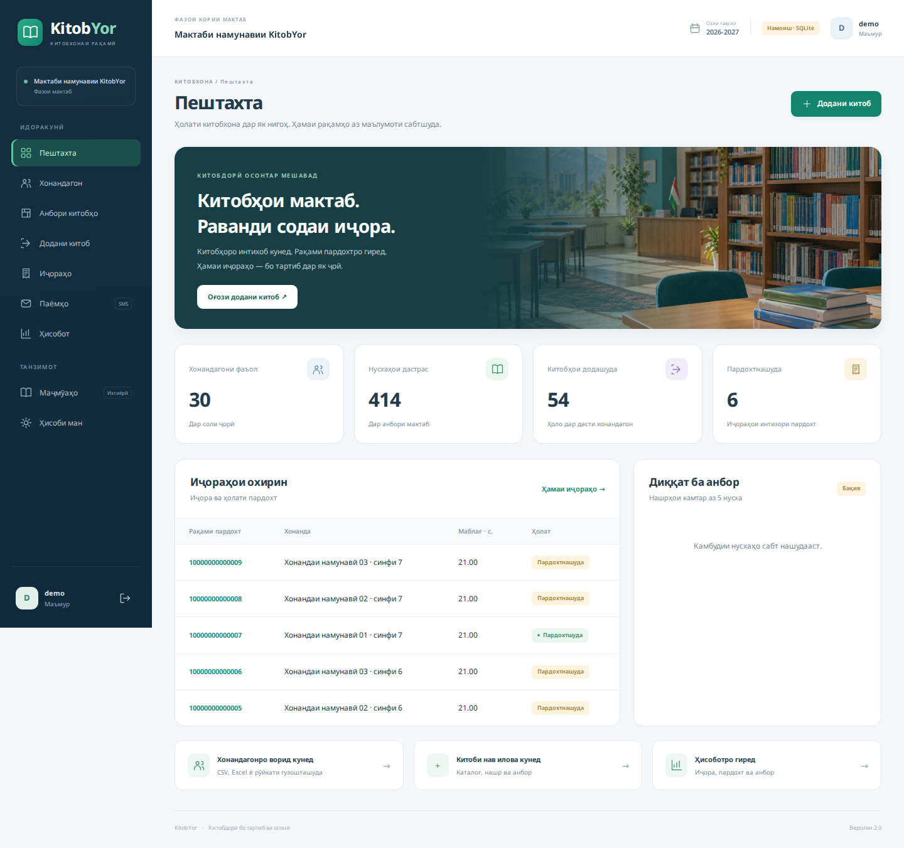
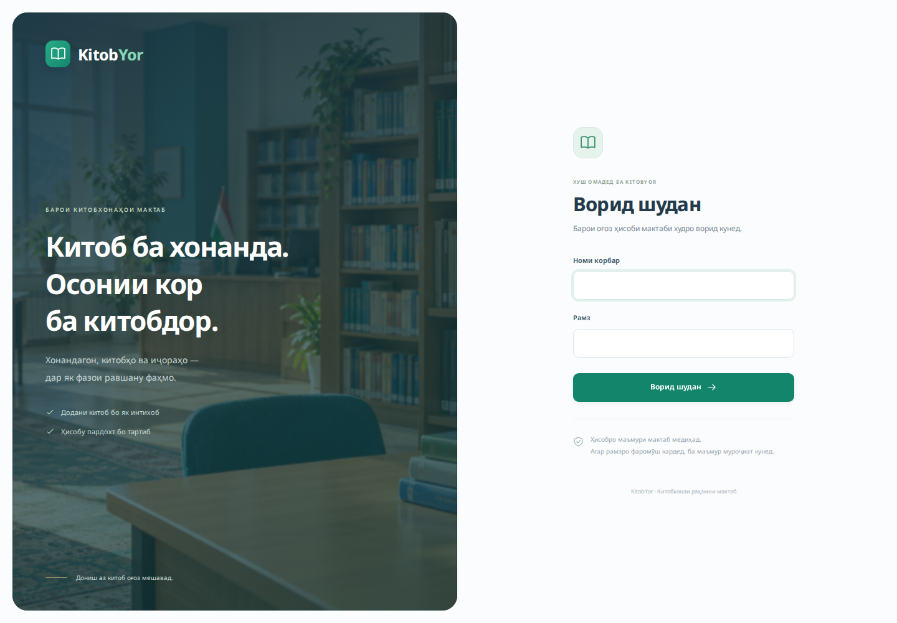
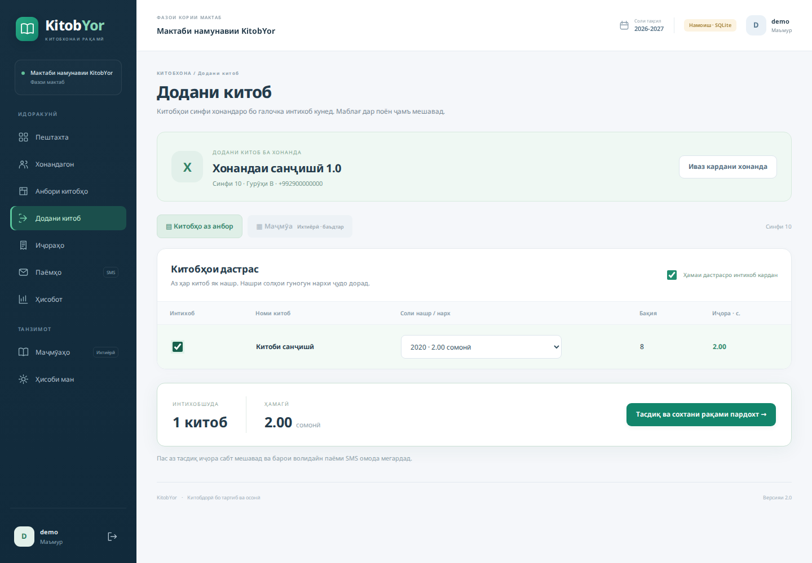
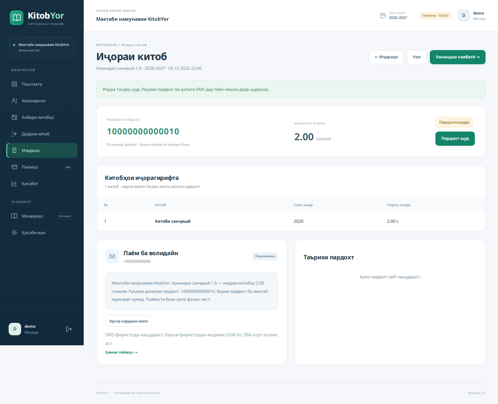
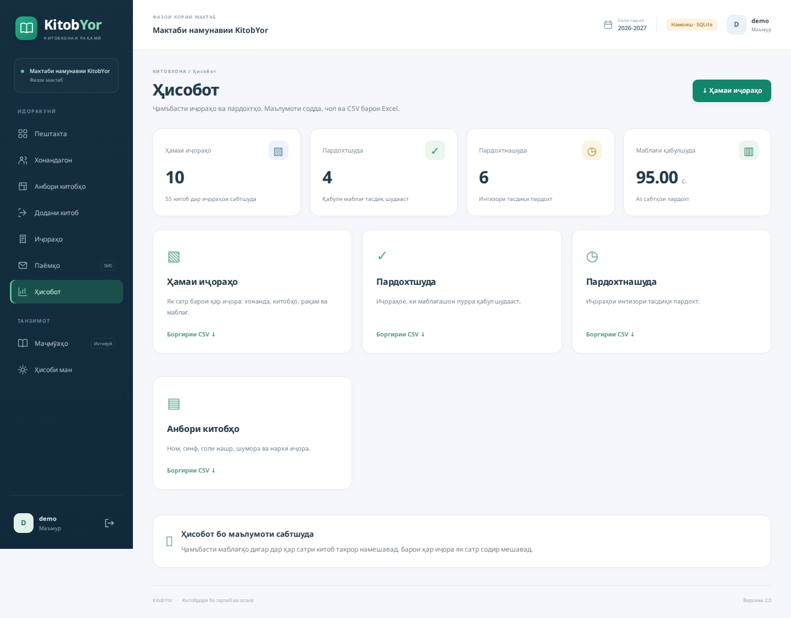
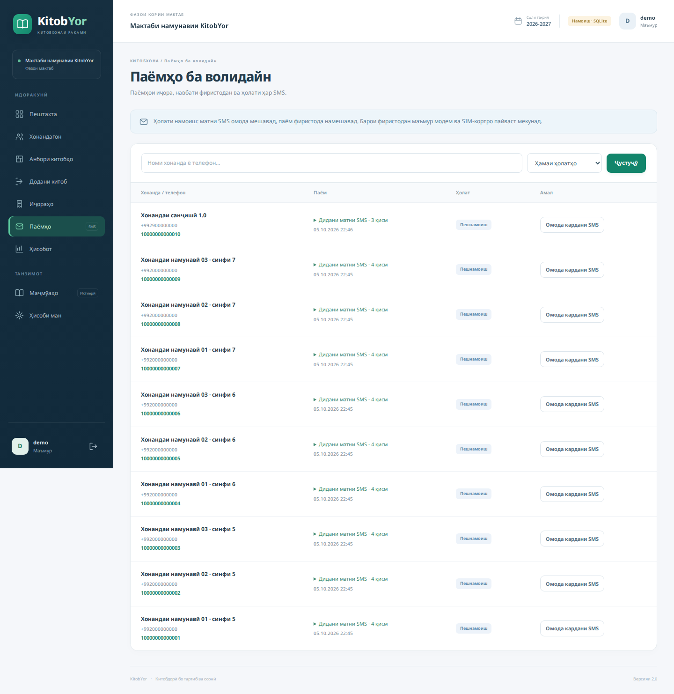
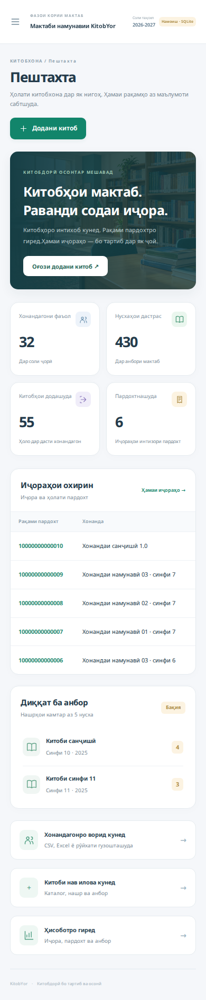
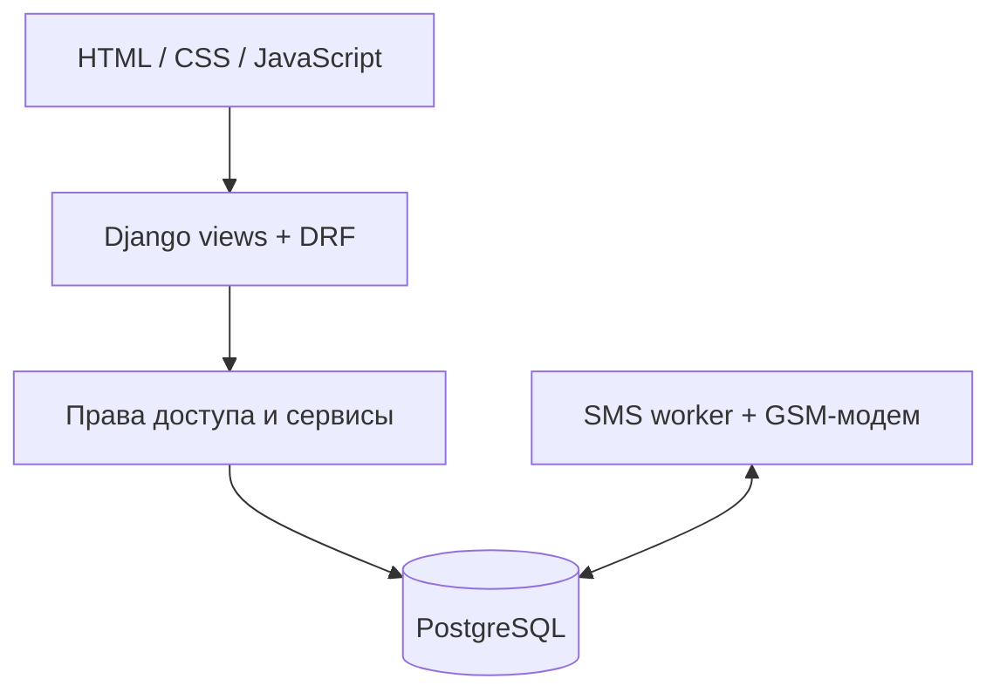

<div align="center">

# KitobYor

### Выдача школьных учебников без лишних действий

Ученики, фонд библиотеки, аренда, оплата и SMS — в одном рабочем пространстве.

[](https://github.com/FayzulloBukhoriev/KitobYor/actions/workflows/tests.yml)


[Быстрый старт](#быстрый-старт) · [Интерфейс](#интерфейс) · [Архитектура](#архитектура) · [Проверка](#проверка-и-текущий-статус) · [Дастур ба тоҷикӣ](docs/README_TJ.md)

</div>



## Задача проекта

При выдаче 10–15 учебников каждому ученику повторный выбор названия, года издания и тарифа замедляет работу библиотекаря. KitobYor собирает доступные книги **по классу ученика** в одном списке: сотрудник отмечает нужные позиции, выбирает издание и сразу видит итоговую стоимость.

Проект ориентирован на школьные библиотеки Таджикистана. Интерфейс — на таджикском языке, документация на этой странице — на русском. Публичной регистрации нет: школу и учётную запись администратора создаёт оператор системы.

**Версия 2.0:** реализованный full-stack проект с локальным демо и конфигурацией развёртывания. Интеграции с банками нет; приём наличных подтверждает уполномоченный сотрудник. Отправка SMS без HTTP API требует физического GSM-модема и SIM-карты.

## Возможности

| Раздел | Что делает сотрудник |
|---|---|
| Ученики | Добавляет ученика или импортирует список из Excel/CSV с предварительной проверкой; фильтрует по классу 1–11 и группе A–E |
| Фонд библиотеки | Указывает название, класс, год издания, доступное количество и стоимость аренды; редактирует остаток с защитой от устаревших изменений |
| Выдача | Выбирает ученика, отмечает книги его класса и выбирает год издания; видит сумму до подтверждения |
| Аренда и оплата | Видит состав выдачи, внутренний номер платежа и статус; подтверждает наличную оплату без дублирования операции |
| SMS | Просматривает очередь и результат передачи; в демо сообщения остаются предпросмотром |
| Отчёты | Получает сводку и выгружает аренду или фонд в CSV |
| Доступ и аудит | Работает в пределах своей школы и роли; администратор просматривает историю действий |

В формах ученика и книги нет обязательного ввода технических кодов или выбора языка. Наборы учебников необязательны. Отдельного интерфейса возврата книг в текущей версии нет.

## Интерфейс

Скриншоты сделаны на демонстрационных данных. Это изображения работающего приложения, а не интерактивный сайт на GitHub Pages.

| Вход | Выдача учебников |
|---|---|
|  |  |

| Аренда и оплата | Отчёты |
|---|---|
|  |  |

<details>
<summary>Очередь SMS и мобильный интерфейс</summary>





</details>

Локальный шрифт Noto Sans поддерживает таджикскую кириллицу. Интерфейс адаптирован для небольших экранов, включает видимый фокус клавиатуры и учитывает уменьшение анимации в настройках системы. Информация об изображении и лицензии шрифта — в [ASSETS.md](docs/ASSETS.md).

## Быстрый старт

**Нужно:** Python 3.11+ (рекомендуется 3.12), Git и интернет при первой установке зависимостей. Node.js и Docker для локального просмотра не нужны.

```bash
git clone https://github.com/FayzulloBukhoriev/KitobYor.git
cd KitobYor
python test.py runserver
```

На Linux используйте `python3`, если команды `python` нет. На Windows можно выполнить `py -3.12 test.py runserver`.

Launcher создаёт `.venv`, устанавливает зависимости, выполняет миграции и создаёт демонстрационную школу. Затем откройте **http://127.0.0.1:8000/login/**.

- Логин: `demo`.
- Случайный пароль выводится в терминал **при первом запуске**. Сохраните его.
- Остановка: `Ctrl+C`. При повторном запуске данные сохраняются в `local_data/`.
- Другой порт: `python test.py runserver --port 8001`.

Локальное демо использует SQLite. Для многопользовательского развёртывания предусмотрен PostgreSQL. Демонстрационная школа не отправляет SMS даже при включённом GSM-драйвере.

<details>
<summary>Если запуск не удался</summary>

- `python is not recognized`: установите Python и добавьте его в PATH либо используйте `py -3.12`.
- `can't open file test.py`: откройте терминал в папке с `test.py` и `manage.py`.
- Ошибка `venv` на Linux: установите пакет `python3-venv` для своей версии Python.
- Занят порт: добавьте `--port 8001`.
- Забыли пароль демо: выполните команду ниже, не удаляя базу данных.

Windows:
```powershell
.venv\Scripts\python.exe manage.py seed_demo --reset-password --settings=config.demo_settings
```

Linux:
```bash
.venv/bin/python manage.py seed_demo --reset-password --settings=config.demo_settings
```

</details>

## Архитектура

**Модульный монолит:** Django обслуживает HTML-интерфейс и REST API; бизнес-правила сосредоточены в слое сервисов. Это позволяет использовать общую проверку прав и транзакций в обоих интерфейсах без отдельной сборки frontend.



| Слой | Реализация |
|---|---|
| Backend | Python, Django 5.2, Django REST Framework |
| Данные | PostgreSQL, Django ORM, миграции; SQLite для демо |
| Frontend | Django Templates, CSS, JavaScript, локальный Noto Sans |
| Импорт | CSV и Excel через openpyxl, предварительная проверка |
| SMS | Очередь в БД, pySerial, AT-команды, UCS2 PDU |
| Развёртывание | Docker Compose, Gunicorn, WhiteNoise, Caddy/HTTPS |
| CI | Django tests с PostgreSQL, проверка миграций, сборка Docker image |

### Инженерные решения

- **Изоляция школ.** Доступ привязан к Membership и роли; запросы ограничены школой пользователя.
- **Целостность выдачи.** Остатки, строки выдачи, счёт и аудит меняются в транзакции. Денежные значения используют `Decimal`; цена фиксируется в момент выдачи.
- **Идемпотентность.** Повторное подтверждение той же операции не должно создавать вторую выдачу или повторную оплату.
- **Конкурентное редактирование.** Revision анбора проверяется перед сохранением: устаревшая форма не перезаписывает новый остаток.
- **Безопасность SMS.** Принятые модемом части не отправляются повторно автоматически. Неопределённый результат требует проверки оператором.
- **Контроль доступа.** Session authentication, CSRF, ограничения попыток входа, CSP и журнал действий.

Подробнее: [обзор решений на русском](docs/ENGINEERING_RU.md), [схема данных](docs/SCHEMA.md), [REST API](docs/API.md).

## SMS без API

Нужны SMS-совместимый USB GSM-модем, активная SIM-карта, баланс и доступ к последовательному порту. Приложение подготавливает сообщение; отдельный worker передаёт его модему.

`preview` → предпросмотр, `queued` → очередь, `submitted` → принято модемом/сетью, `uncertain` → результат требует ручной проверки. **`submitted` не означает подтверждённую доставку на телефон.**

[Настройка и восстановление очереди](docs/SMS.md). Без модема и SIM физическая отправка невозможна. Платёжный номер KitobYor пока является внутренним идентификатором, а не номером для оплаты через банк или Госуслуги.

## Развёртывание

Репозиторий включает `Dockerfile`, `compose.yaml`, Caddy, миграции и скрипт резервного копирования. Порядок запуска: PostgreSQL → миграции → веб-приложение → HTTPS proxy. GSM worker включается отдельно через профиль `sms`.

Сначала скопируйте `.env.example` в `.env`, задайте уникальные секреты, домен и email для TLS. Затем:

```bash
docker compose up -d --build
```

Создание школы с приватным вводом пароля:

```bash
docker compose exec web python manage.py setup_school --code SCH001 --name "Школа №1" --username school-admin --year 2026-2027
```

Подробный порядок, backup/restore и ограничения: [DEPLOYMENT.md](docs/DEPLOYMENT.md). `test.py runserver` предназначен только для локального просмотра.

## Проверка и текущий статус

Последний локальный прогон релиза 2.0: **73 теста прошли, 2 PostgreSQL-specific теста пропущены** при запуске на SQLite. Проверены основные браузерные сценарии и экраны шириной 320/390 px. Протокол GSM проверен симуляцией последовательного порта.

После первого запуска активируйте окружение:

```powershell
# Windows PowerShell
.venv\Scripts\Activate.ps1
```

```bash
# Linux / macOS
source .venv/bin/activate
```

Затем выполните:

```bash
python manage.py test --settings=config.test_settings
```

Для тестовой PostgreSQL-базы с правом создания тестовой БД: `python manage.py test`. Workflow GitHub Actions выполняет тесты с PostgreSQL; его актуальный результат показан в бейдже вверху.

**Перед реальным внедрением** нужны проверка Docker на целевом сервере, PostgreSQL concurrency, восстановление резервной копии и отправка через реальный GSM/SIM. Наличие конфигурации deployment не означает, что эти проверки уже выполнены. Детали: [VALIDATION.md](docs/VALIDATION.md).

## Навигация по коду

| Путь | Назначение |
|---|---|
| `config/` | Настройки Django, маршрутизация, demo/test окружения |
| `library/models.py`, `migrations/` | Предметная модель и история схемы |
| `library/services.py` | Выдача, оплата и операции с фондом |
| `library/api/` | Сериализаторы и REST endpoints |
| `library/ui.py`, `forms.py` | Веб-сценарии и формы |
| `library/sms/` | Кодирование сообщений, модем и worker |
| `templates/`, `static/` | Интерфейс, стили, скрипты и шрифты |
| `library/tests*.py` | Регрессионные тесты |
| `deploy/`, `compose.yaml` | Развёртывание и резервное копирование |
| `docs/` | Документация и скриншоты |

## Развитие

- Интеграция с банком после согласования API и формата платёжного идентификатора.
- Подтверждение доставки SMS от оператора.
- Автоматизированный переход на новый учебный год.
- Приёмочные испытания на оборудовании школы.

История разработки сохранена отдельными тематическими commit-ами. Правила работы с кодом — [CONTRIBUTING.md](CONTRIBUTING.md), изменения релиза — [CHANGELOG.md](CHANGELOG.md).
