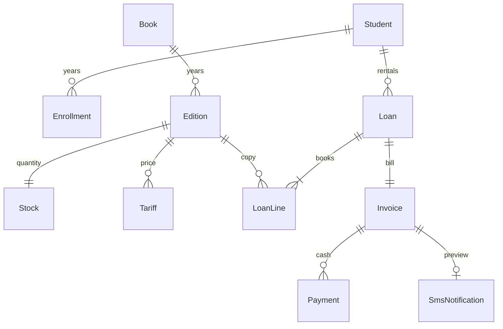

# Схемаи база · 1.0

Манбаи иҷроӣ: library/models.py ва migrations/0001_initial.py, 0002_catalog_rental_contacts_sms.py. Migration 0002 маълумоти 0.2-ро нигоҳ медорад; initial migration тағйир дода нашудааст.

| Ҷадвал | Вазифа ва маҳдудият |
|---|---|
| School / Membership | Мактаб, соли таҳсил, нақш ва ваколати корбар |
| Student | Ном, суроға, parent_name, parent_phone; school + code unique, рамз худкор |
| Enrollment | student + academic_year unique; grade 1–11, group A–E аз command |
| Book / Edition | Ном ва синф; нашр бо сол 1900–2100; рамзҳои дохилии худкор |
| Stock | Якто барои нашр, available/damaged ≥ 0 |
| Tariff | edition + academic_year unique; Decimal fee ≥ 0 |
| Kit / KitItem | Ихтиёрӣ; барои оянда ва таърихи 0.2 |
| Loan | Мактаб, хонанда, соли таҳсил, kit nullable, token unique, request_hash |
| LoanLine | edition, student, kit_item nullable, tariff, snapshot-и ном/сол/нарх |
| Invoice | loan unique, reference UUID unique, total ≥ paid ≥ 0; payment_number property |
| Payment | Маблағ > 0, token unique, school + receipt unique |
| SmsNotification | invoice OneToOne, destination/body, status, sent_at, provider_reference |
| StockMovement / AuditEvent | Таърихи бақия ва амалҳои масъул |
| ImportBatch / LoginAttempt | Идемпотентии импорт ва маҳдудияти кӯшишҳои login |

Publisher, ISBN ва language-и каталог дар база барои мувофиқат бо 0.2 мондаанд, дар формаи нав истифода намешаванд. Баргардонии таърихӣ нигоҳ дошта мешавад; route-и нав надорад. FK-и ҳисобдорӣ PROTECT дорад. LoanLine unique-и шартӣ барои edition/kit_item-и issued дорад; пешгирии ду нашри як Book бо қулфи мактаб дар services иҷро мешавад. Мувофиқати мактаб, синф ва алтернативаҳо низ қоидаи services аст.

Маблағ PostgreSQL NUMERIC / Python Decimal аст. Нархҳо дар сомонӣ. Нарх аз соли нашр худкор тахмин намешавад: масъул нархи ҳар нашрро ворид мекунад.

