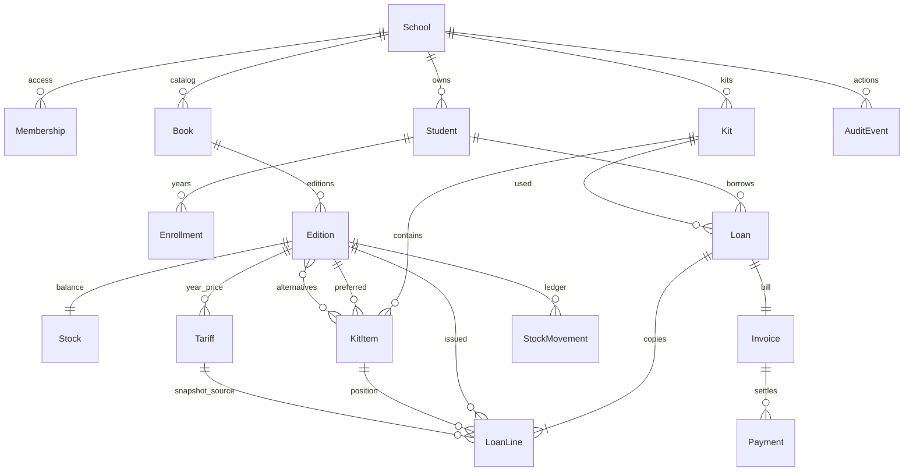

# Схемаи PostgreSQL

Манбаи иҷроӣ: `library/models.py` ва `library/migrations/0001_initial.py`. SQL аз мигратсия тавассути `python manage.py sqlmigrate library 0001` дар муҳити PostgreSQL гирифта мешавад.

| Ҷадвал | Майдонҳои асосӣ / маҳдудият |
|---|---|
| School | code unique, name, academic_year |
| Membership | user unique, school, role: admin/librarian/accountant/viewer |
| Student | school + code unique, full_name, address, active |
| Enrollment | student + academic_year unique; grade 1–11, group, language |
| Book | school + code unique; title, subject, grade 1–11, language |
| Edition | book + code unique; year 1900–2100, publisher, isbn |
| Stock | edition unique; available ва damaged ғайриманфӣ |
| Tariff | edition + academic_year unique; fee ≥ 0, approved, note |
| Kit | school + grade + language + academic_year unique |
| KitItem | kit + label unique; preferred, alternatives, position |
| Loan | school, student, kit, academic_year, token unique, request_hash, created_by/time |
| LoanLine | edition, student, kit_item, tariff; title/year/fee_snapshot; state, closed_at |
| Invoice | loan unique; school, reference UUID unique, total ≥ paid ≥ 0 |
| Payment | invoice, school, amount > 0; token unique; school + receipt unique |
| StockMovement | edition, delta_available, delta_damaged, kind, note, actor/time |
| AuditEvent | school, actor, action, object_id, detail, time |
| ImportBatch | school, token, file_hash, state; танҳо схема, API-и импорт ҳанӯз нест |
| LoginAttempt | key hash unique, failures, window_start |

LoanLine маҳдудиятҳои unique-и шартӣ дорад: хонанда наметавонад ҳамон KitItem ё Edition-ро ду бор бо ҳолати `issued` нигоҳ дорад. Китоби баргардонда иҷораи нав дошта метавонад. Ҳолати issued бояд closed_at холӣ дошта бошад; ҳолати баста сана мехоҳад.

Пул бо Decimal / PostgreSQL NUMERIC нигоҳ дошта мешавад. Ҳамаи маблағҳо дар интерфейс бо ду рақами касрӣ. Номи маблағ/асъор барои ҳамин MVP сомонӣ қабул шудааст; multcurrency нест.

FK-ҳои ҳисобдорӣ PROTECT доранд. Маҳдудияти синф ва маблағ дар DB низ ҳаст; мувофиқати мактаб/забон/нашри алтернатива дар services санҷида мешавад. Дар DB маҳдудияти 5–15 KitItem нест: он қоидаи command-и create_kit аст.

Stock танҳо бақияи дастрас ва осебдидаро нигоҳ медорад. Додашуда аз LoanLine, ҳаракат аз StockMovement гирифта мешавад. Тасҳеҳи бақия ва сверкаи ҷисмонии анбор API-и ҷудогонаи оянда мехоҳанд.
